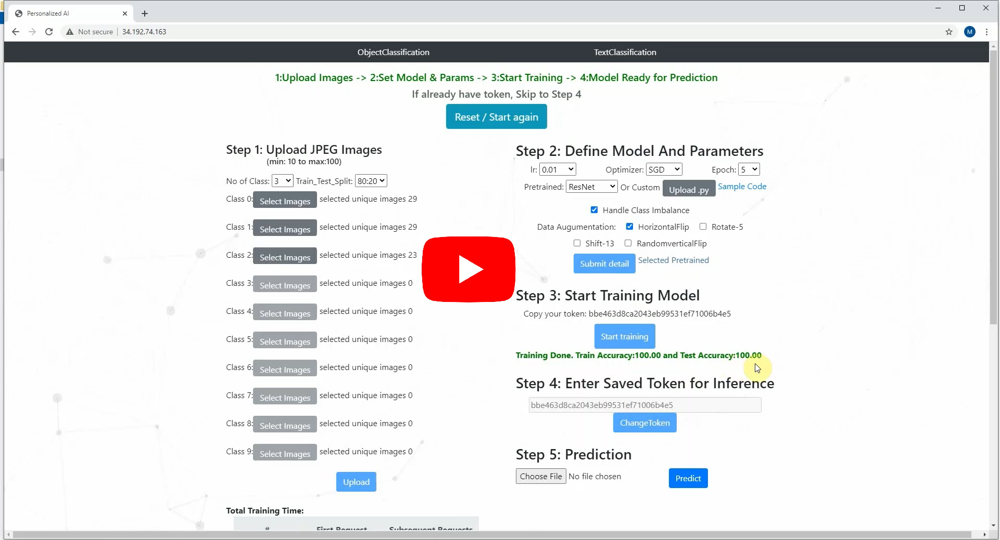

# PersonalizeAI: End to End DL Platform

PersonalizeAI platform allows user to create, train & deploy DL model without writing code

**Website:** http://34.192.74.163/

**Demo Video:**  

**AWS EC2 Machine:**  
T3 CPU for hosting website (ReactJs + Django + Nginx)  
P2 GPU for training DL Model (Flask + Pytorch Training + Nginx)

**Technology Stack:**  
ReactJS: Frontend  
Django: Backend  
Ngnix+uWSGI: Webserver  
Flask: On Training Compute  
S3: Storage  
REST API  

 
Adding more info soon ...
